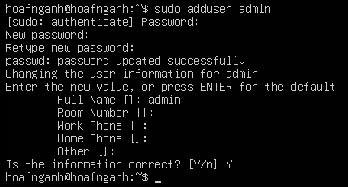

# Linux

Cần nắm:

```bash
cd, ls, cat, less, grep, find, awk, sed
chmod, chown, ps, top, kill
systemctl, journalctl
ss, netstat, lsof
crontab
ssh, scp
```

| cd | change dir: chuyển thư mục |
| --- | --- |
| ls | liệt kê |
| cat | hiển thị nội dung |
| less | hiển thị nội dung theo màn hình, có thể cuộn lên cuộn xuống |
| grep | tìm kiếm trong file theo regex |
| find | tìm kiếm dựa trên đệ quy toàn bộ hệ thống |
| sed | trình chỉnh sửa luồng |
| awk | ngôn ngữ lập trình chuyên cho xử lý văn bản |
| chmod | chỉnh sửa quyền (read, write, execute) đối với user, group, other |
| chown | chỉnh sửa quyền sở hữu |
| ps | trạng thái tiến trình (tại 1 thời điểm) |
| top | trạng thái tiến trình thời gian thực |
| kill | kết thúc tiến trình |
| systemctl | truy vấn, gửi lệnh điều khiển tới quản lý hệ thống |
| journalctl | truy vấn log |
| ss (netstat) | công cụ tương tự netstat |
| Các trường trong ss: |  |
| • Netid: loại giao thức mạng (tcp/udp) |  |
| • State: trạng thái hiện tại |  |

```
  ◦ UNCONN: không kết nối
  ◦ LISTEN: mở cổng và chờ kết nối
  ◦ ESTAB: thiết lập kết nối thành công
```

• Recv-Q: Hàng đợi nhận ◦ Đối với LISTEN: số lượng kết nối đang chờ accept ◦ Đối với ESTAB: số lượng byte ứng dụng chưa kịp đọc ra từ mạng • Send-Q: Hàng đợi gửi ◦ Đối với LISTEN: kích thước tối đa của hàng đợi kết nối ◦ Đối với ESTAB: số lượng byte dữ liệu đã gửi đi nhưng chưa nhận được gói ACK • Local Address:Port: Địa chỉ IP và cổng máy cục bộ • Peer Address:Port: Địa chỉ IP và cổng máy đối tác • Process: Thông tin về tiến trình sử dụng socket | | lsof | Liệt kê tất cả mọi thứ được coi là file | | crontab | Lên lịch thực hiện tác vụ | | ssh | Giao thức thiết lập kênh an toàn | | scp | Sao chép tệp tin từ xa |

# Bài thực hành

```
- Dựng 1 Ubuntu Server VM
- Tạo 3 user: admin, dev, guest
- Cấu hình SSH key login
- Tắt root SSH login
- Bật UFW chỉ cho phép 22, 80
- Xem log đăng nhập trong /var/log/auth.log
```

## Dựng Ubuntu server

Cài tool:

```bash
sudo apt install -y vim curl wget net-tools ufw openssh-server
```

## Tạo 3 user: admin, dev, guest

Để tạo user ta dùng lệnh: `sudo adduser <tên>` , `useradd` cũng được tuy nhiên thì sẽ không tạo group cho user mới luôn.



Thêm người dùng vào group: `sudo usermod -aG <group> <user>`

`-a` : append

`-G`: group thêm

Chuyển đổi người dùng: `su - <user>`

Check group: `groups <user>` hoặc `id <user>`

`visudo`: lệnh mở `/etc/sudoers` trong `vi`


Xoá người dùng: `deluser <user>` , nếu muốn xoá thư mục home của user thì thêm tham số `--remove-home` tương đương `-r`, thêm tham số `-f` bất chấp user có đang chạy tiến trình gì, `--backup-home` dùng để vừa xoá thư mục home vừa tạo backup.

Khoá người dùng: `passwd -l <user>` với `-l` là tham số khoá (lock), muốn mở lại thì dùng tham số `-u`.

Vô hiệu hoá người dùng (no login shell): Một cách tiếp cận khác là thay đổi shell đăng nhập mặc định của người dùng thành một shell không tồn tại hoặc rỗng (như `/usr/sbin/nologin` hoặc `/bin/false`). Điều này ngăn người dùng thiết lập phiên shell tương tác khi đăng nhập.

```bash
sudo usermod -s /usr/sbin/nologin <user>
```

Với `-s`: shell

Quay về shell cũ:

```bash
sudo usermod -s /bin/bash <user>
```

Giới hạn người dùng sử dụng `rbash` (Restricted shell) \[<https://viblo.asia/p/leo-thang-dac-quyen-trong-linux-linux-privilege-escalation-3-bypass-restricted-shell-3P0lPPyGlox>\]

- Bước 1:

```bash
sudo chsh -s /bin/rbash guest
```

`chsh`: change shell

`-s`: shell

Khi `rbash` khởi chạy, nó sẽ tự động kích hoạt tính năng cấm lệnh `cd`,

- Bước 2: Tạo thư mục `bin` chứa các lệnh chỉ cho phép:

  - `ls`
  - `cat`
  - `clear`

  ```bash
  sudo mkdir -p /home/guest/bin
  
  sudo ln -s /bin/ls /home/guest/bin/ls
  sudo ln -s /bin/cat /home/guest/bin/cat
  sudo ln -s /usr/bin/clear /home/guest/bin/clear
  ```

- Bước 3: Khoá biến môi trường `$PATH` nhằm không thể thao tác với đường dẫn mặc định của hệ thống

```bash
PATH=$HOME/bin
export PATH
```

- Bước 4: Sửa quyền của các file cấu hình để user không sửa được biến `PATH`

```bash
# Chuyển quyền sở hữu thư mục bin và các file cấu hình về root
sudo chown root:root /home/guest/bin
sudo chown root:root /home/guest/.bashrc /home/guest/.profile /home/guest/.bash_profile 2>/dev/null

# Cấu hình chỉ cho phép guest ĐỌC và CHẠY, cấm SỬA ĐỔI (Chmod 755)
sudo chmod 755 /home/guest/.bashrc /home/guest/.profile /home/guest/.bash_profile 2>/dev/null
```

## Cấu hình SSH key login

Trên máy thật, tạo cặp khoá ssh:

```bash
> ssh-keygen -t rsa
Generating public/private rsa key pair.
Enter file in which to save the key (/home/hoafnganh/.ssh/id_rsa):
Enter passphrase for "/home/hoafnganh/.ssh/id_rsa" (empty for no passphrase):
Enter same passphrase again:
Your identification has been saved in /home/hoafnganh/.ssh/id_rsa
Your public key has been saved in /home/hoafnganh/.ssh/id_rsa.pub
The key fingerprint is:
SHA256:K+SOOYiorHvnNaNv7bsc7VVtVjlp4xAmg6G6MG09a2E hoafnganh@DESKTOP-H9VAT4L
The key's randomart image is:
+---[RSA 3072]----+
|         .oo o   |
|        ..  + . o|
|       .     . *.|
|    . o       +.+|
|   o +.ES     ..+|
|    +oo +o   . o |
|.. . .*+o . .    |
|+ o o*o=.o .     |
|*+ o=+o.=o.      |
+----[SHA256]-----+
```

Trong .ssh có 2 file `id_rsa` và `id_rsa.pub`, gửi file `pub` cho ubuntu server.

```bash
scp .../id_rsa.pub hoafnganh@<ip>:/home/hoafnganh
```

Dán nội dung file `pub` vào `~/.ssh/authorized_keys` .

Kiểm tra bằng cách ssh từ máy thật vào ubuntu server, nếu không cần password thì là thành công.

## Tắt root SSH login

Kiểm tra file cấu hình ssh: `/etc/ssh/sshd_config` và cả trong `sshd_config/*.conf`

Cấu hình tại file config:

```bash
PermitRootLogin no # khong cho root dang nhap ssh truc tiep
PubkeyAuthentication yes # cho phep dang nhap bang ssh key
PasswordAuthentication no # khong cho dang nhap ssh bang mat khau
KbdInteractiveAuthentication no # tat kieu hoi mat khau tuong tac
```

Kiểm tra cấu hình có lỗi cú pháp không: `sudo sshd -t` , nếu không in ra gì thì thành công.

Với cấu hình trên khi ssh vào người dùng khác sẽ bị từ chối do tắt PasswordAuthentication.

## Bật UFW chỉ cho phép 22, 80

Check trạng thái ufw: `sudo ufw status verbose`

Thiết lập mặc định:

```bash
sudo ufw default deny incoming
sudo ufw default allow outgoing
```

Cho phép từng port:

```bash
sudo ufw allow 22/tcp
sudo ufw allow 80/tcp
```

Bật ufw: `sudo ufw enable`

Kiểm tra: `sudo ufw status numbered`

<https://www.digitalocean.com/community/tutorials/how-to-set-up-a-firewall-with-ufw-on-ubuntu>

## Xem log đăng nhập trong /var/log/auth.log

Log đăng nhập ssh: `/var/log/auth.log`

Xem real time: `sudo tail -f /var/log/auth.log`


Login thành công: Accepted publickey

Trường hợp tắt password authentication và bật pubkey authentication: Connection closed by authenticating user…

Trường hợp sai user: Connection closed by invalid user…