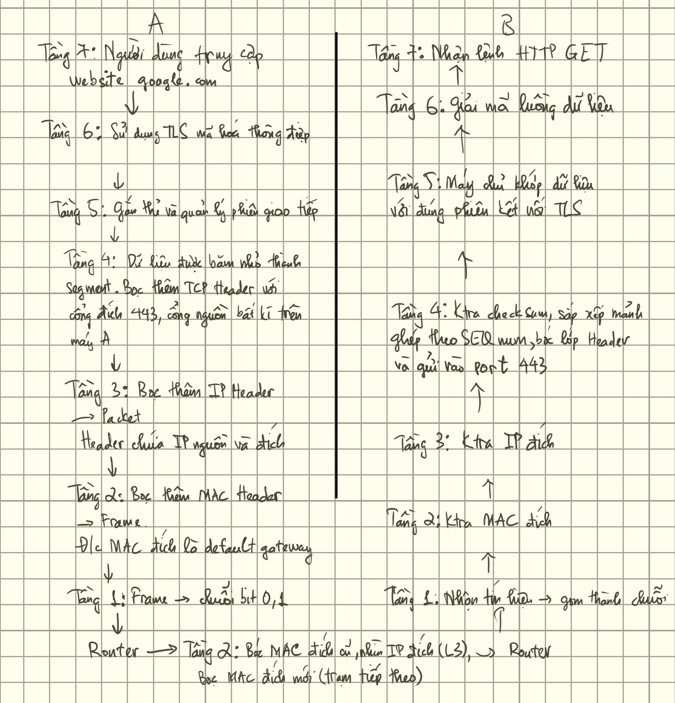

# Network

## IP, Subnet, CIDR

### IP

Địa chỉ IP là địa chỉ duy nhất dùng để định danh thiết bị trong mạng, là dãy số 32 bit gồm 4 octet.

- IP private: địa chỉ IP chỉ dùng trong mạng nội bộ, không trực tiếp truy cập Internet.
- IP public: là địa chỉ ISP cung cấp cho bộ định tuyến, là địa chỉ mà các thiết bị bên ngoài sẽ sử dụng để nhận dạng mạng này. Đối với thiết bị bên trong, địa chỉ IP public là địa chỉ các thiết bị trong mạng sẽ sử dụng để giao tiếp bên ngoài Internet. IP public có thể động hoặc tĩnh.

### Subnet

Subnet mask là chuỗi số 32 bit gồm 4 octet, đi kèm địa chỉ IP với mục đích là phân tách địa chỉ IP thành 2 phần: phần mạng (Network ID) và phần thiết bị (Host ID).

Mỗi mạng sẽ được gán subnet mask, giúp xác định địa chỉ IP nào được tồn tại trong nó.

Subnetting là chia mạng lớn thành các mạng con, mục đích là:

- Tối ưu không gian địa chỉ IP
- Tối ưu hiệu suất
- Cô lập các nhóm
- Dễ quản lý - cấp IP - chia tài nguyên

Subnetting thường thực hiện ở tầng 3

### CIDR

Class-less Inter Domain Routing là cách viết địa chỉ gọn hơn bằng cách sử dụng dấu `/` để biểu thị số bit thuộc phần network của subnet mask.

Ví dụ: `192.168.1.10/24` tương đương `255.255.255.0`

## TCP/UDP

### TCP

[Transmission Control Protocol (TCP) - GeeksforGeeks](https://www.geeksforgeeks.org/computer-networks/what-is-transmission-control-protocol-tcp/)

TCP là giao thức đáng tin cậy cho phép thiết bị giao tiếp trong mạng. Nó đảm bảo các gói tin được truyền đến đầy đủ và đúng thứ tự.

Hoạt động trên tầng 4.

TCP thiết lập kết nối logic giữa người gửi và người nhận trước khi chuyển dữ liệu. TCP đảm bảo gói tin được truyền chính xác và đúng thứ tự bằng ACK và SEQ.

TCP phát hiện lỗi bằng cách dùng checksum và gửi lại các gói tin đã mất hoặc hỏng → đảm bảo toàn vẹn dữ liệu.

Bắt tay 3 bước TCP:


1. Người gửi gửi gói có cờ SYN tới người nhận để yêu cầu kết nối
2. Người nhận trả về gói có cờ SYN-ACK, xác nhận yêu cầu và chấp nhận kết nối
3. Người gửi phản hồi bằng gói có cờ ACK, xác nhận rằng kết nối đã được thiết lập

Khi ứng dụng gửi dữ liệu, TCP phân mảnh dữ liệu thành các phân đoạn nhỏ gọi là segment.

Mỗi segment có header chứa thông tin như sequence num, port, cờ.

TCP truyền dữ liệu không quan tâm đường đi, đường đi do IP đảm nhận.

TCP sắp xếp lại thứ tự gói tin tại nơi nhận.

Người nhận gửi cờ ACK cho mỗi segment để xác nhận rằng đã nhận 1 cách chính xác. Nếu người gửi chưa được nhận ACK, bên đó mặc định rằng gói tin chưa được gửi đúng cách và gửi lại.

Cấu trúc gói tin TCP:


1. **Source port và destination port (đều dài 16 bit)**: được sử dụng để định danh cho session của giao thức nào đó trên lớp ứng dụng đang được truyền tải trong TCP segment đang xét
2. **Sequence number (32 bit)**: dùng để đánh số thứ tự gói tin (từ số sequence nó sẽ tính ra được số byte đã được truyền).
3. **Acknowledge number (32 bit):** dùng để báo đã nhận được gói tin nào và mong nhận được byte mang số thứ tự nào tiếp theo.
4. **Header length (4 bit)**: cho biết toàn bộ header dài bao nhiêu tính theo đơn vị word (1 Word = 4 byte).
5. **Các bit reserverd (4 bit)**: đều được thiết lập bằng 0
6. **Các bit control (9 bit)**: các bit dùng để điều khiển cờ (flag) ACK, cờ Sequence...
7. **Window size (16 bit)**: số lượng byte được thiết bị sẵn sàng tiếp nhận
8. **Checksum (16 bit)**: kiểm tra lỗi của toàn bộ TCP segment
9. **Urgent pointer (16 bit)**: sử dụng trong trường hợp cần ưu tiên dữ liệu
10. **Options (tối đa 32 bit)**: cho phép thêm vào TCP các tính năng khác
11. **Data**: dữ liệu của lớp trên

### UDP

UDP là giao thức truyền tải cung cấp sự nhanh nhẹn, nhẹ về giao tiếp giữa các tiến trình. Khác với TCP, UDP sẽ không quan tâm về thứ tự hay gói tin đã đến nơi nhận đúng cách chưa. UDP nhanh hơn TCP nhưng độ tin cậy thấp hơn.


1. **source port** và **destination port(đều 16 bit)**: cho phép định danh một session của một ứng dụng nào đó chạy trên UDP. Có thể coi port chính là địa chỉ của tầng Transport
2. **UDP length(16 bit)**: cho biết chiều dài của toàn bộ UDP datagram tổng cộng bao nhiêu byte. (16 bit thì sẽ có tổng cộng $2^{16}$ byte = 65536 giá trị (từ 0 -> 65535 byte)).
3. **UDP checksum(16 bit)**: sử dụng thuật toán mã vòng CRC để kiểm lỗi cho toàn bộ UDP datagram và chỉ kiểm tra một cách hạn chế
4. **Data**: dữ liệu tầng trên được đóng gói vào UDP datagram đang xét.

So sánh:

| TCP | UDP |
| --- | --- |
| Hướng kết nối | Hướng không kết nối |
| Độ tin cậy cao | Độ tin cậy thấp |
| Gửi dữ liệu dạng luồng byte | Gửi đi Datagram |
| Không cho phép mất gói tin | Cho phép mất gói tin |
| Đảm bảo việc truyền dữ liệu | Không đảm bảo việc truyền dữ liệu |
| Có sắp xếp thứ tự các gói tin | Không sắp xếp thứ tự các gói tin |
| Tốc độ truyền thấp hơn UDP | Tốc độ truyền cao |

## DNS

Là hệ thống phân giải tên miền, chuyển đổi tên miền website dễ nhớ thành địa chỉ IP để máy tính hiểu và kết nối.

### 1. Domain namespace

Domain namespace chứa một cay, gồm các domain name. Mỗi node giữ thông tin đại diện cho domain name.

### 2. Domain names

Mỗi domain name có nhãn riêng, nhãn rỗng là root. Một domain name đầy đủ là thứ tự nhãn trong đường dẫn từ nó đến root.

### 3. Domains

Là một nhánh của namespace. Domain là tập các node có cùng một node cha. Tên domain này chính là tên node cha.


### 4. Resource records

Chứa dữ liệu ứng với domain name.

- **SOA**(Start of Authority): Chỉ ra rằng server này là nơi tốt nhất để cung cấp dữ liệu và thông tin cho toàn zone. Name server được đánh giá có quyền lực nhất trong zone thông qua SOA record này.
- **NS**(Name Server): Record này chỉ ra đâu là nameserver cho toàn zone.
- **A**(Address): record này chịu trách nhiệm phân giải tên sang IP
- **PTR**(Pointer): record này chịu trách nhiệm phân giả IP sang tên
- **MX**(Mail Exchangers): record này chỉ ra đâu là mail server cho domain.

### 5. Các loại DNS Server

1. DNS Recursor: giống như “thủ thư”. Khi ta truy cập trang web, browser sẽ nhờ DNS Recursor đi tìm địa chỉ IP
2. Root Name Server: coi như mục lục trong thư viện chỉ đến giá sách khác nhau. 
3. Top Level Domain Name Server: coi như là giá sách cụ thể trong thư viện.
4. Authoritative Name Server: coi như một cuốn từ điển trên giá sách

### 6. Các bước phân giải tên miền

1. Người dùng nhập "google.com" vào browser. Truy vấn sẽ được truyền vào Internet và được nhận bởi DNS Recursor
2. DNS Recursor sẽ gửi truy vấn tới Root Name Server (.)
3. Root Name Server sẽ trả về địa chỉ IP của TLD Name Server ( ở đây sẽ là .com TLD)
4. DNS Recursor tiếp tục gửi truy vấn tới .com TLD
5. .com TLD sẽ phản hồi bằng địa chỉ IP của [google.com](http://google.com/) Authoritative Name Server
6. DNS Recursor lại gửi truy vấn tới [google.com](http://google.com/) Authoritative Name Server
7. [google.com](http://google.com/) Authoritative Name Server sẽ trả về địa chỉ IP của [google.com](http://google.com/) cho DNS Recursor
8. DNS Recursor phản hồi lại browser địa chỉ IP của tên miền được yêu cầu Sau khi thực hiện 8 bước trên thì browser đã có thể thực hiện request rồi.
9. Browser thực hiện HTTP Request đến địa chỉ IP vừa truy vấn xong
10. Server response dữ liệu về cho browser


Ta có thể can thiệp vào truy vấn DNS trong `/etc/hosts/`. Giả sử ta biết địa chỉ IP nhưng nó không có tên miền, ta có thể cấu hình bên trong file hosts để gán tên miền cho nó.

## HTTP/HTTPS

### HTTP

Là giao thức để trao đổi giữa web browser và web server. Thường HTTP giao tiếp ở cổng 80.

Các header:

| Host | Nó cho biết tên miền (domain name) của máy chủ mà bạn muốn truy cập. |
| --- | --- |
| User-Agent | Nó chứa thông tin về trình duyệt (Chrome, Safari, Firefox), phiên bản, và hệ điều hành bạn đang dùng. Server dựa vào đây để trả về giao diện mobile/desktop phù hợp hoặc chặn các bot tự động. |
| Authorization | Chứa thông tin giấy thông hành (credentials/token) để chứng minh bạn có quyền truy cập vào dữ liệu mật. Thường thấy nhất khi làm việc với API. |
| Cookie | Mỗi khi bạn gửi yêu cầu lên server, trình duyệt sẽ tự động đính kèm các "mẩu dữ liệu" nhỏ (Cookie) mà server đã nhờ trình duyệt lưu trước đó. Đây là cách server nhớ được bạn là ai (duy trì trạng thái đăng nhập, giỏ hàng...). |
| Set-Cookie |  |
| Content-Type | Mô tả định dạng của dữ liệu đang được truyền đi (MIME type) để bên nhận biết cách giải mã.
*Ví dụ:* `Content-Type: application/json` (Dữ liệu dạng JSON) hoặc `text/html` (Mã HTML của trang web). |
| Content-Length | Cho biết độ lớn của gói dữ liệu tính bằng đơn vị *bytes*. Nó giúp bên nhận biết được khi nào thì tải xong toàn bộ dữ liệu để đóng kết nối. |
| Referer | Nó chứa URL của trang web trước đó chứa link mà bạn vừa click vào. |
| Origin | Tương tự Referer nhưng chỉ chứa Nguồn (Giao thức + Tên miền + Cổng), không chứa đường dẫn chi tiết. |
| X-Forwarded-For | Khi một yêu cầu đi qua hệ thống mạng trung gian (như Proxy, VPN, hoặc Load Balancer), IP gốc của bạn sẽ bị che mất và thay bằng IP của proxy. Header này được các hệ thống trung gian chèn thêm vào để báo cho máy chủ đích biết **IP thực sự** của người dùng cuối. |
| Location | Máy chủ dùng header này để điều hướng (redirect) bạn sang một trang khác. Nó luôn đi kèm với các mã trạng thái HTTP như 301 (Chuyển viễn viễn) hoặc 302 (Chuyển tạm thời). |
| Server | Máy chủ "tự giới thiệu" về phần mềm và hệ điều hành nó đang sử dụng (ví dụ: `Server: nginx/1.18.0` hoặc `Apache`). |

Status code

| 200 | Yêu cầu xử lý thành công |
| --- | --- |
| 201 | Yêu cầu đã thành công và tài nguyên mới được tạo ra trong DB |
| 301 | Tài nguyên yêu cầu đã chuyển sang URL mới |
| 302 | Tài nguyên chuyển sang URL mới tạm thời |
| 400 | Máy chủ không hiểu yêu cầu người dùng do cú pháp sai |
| 401 | Lỗi xác thực |
| 403 | Lỗi phân quyền |
| 404 | Máy chủ không thấy tài nguyên khớp với URL người dùng đưa ra |
| 500 | Một lỗi chung chung không xác định đã xảy ra bên trong máy chủ |
| 502 | Thường xảy ra khi máy chủ web của bạn đang hoạt động như một trạm trung chuyển (Proxy/Gateway). Nó cố gắng gọi một máy chủ khác (upstream server) để lấy dữ liệu, nhưng lại nhận được phản hồi không hợp lệ hoặc bị lỗi từ máy chủ kia. |
| 503 | Máy chủ hiện tại không thể xử lý yêu cầu. |

### HTTPS

HTTPS là giao thức HTTP nhưng có thêm mã hoá bằng SSL/TLS

## DHCP

## SSL/TLS

Sử dụng mã hoá khoá công khai để trao đổi khoá phiên, mỗi khoá phiên chỉ được sử dụng trong 1 phiên.

Sử dụng khoá phiên và mã hoá khoá bí mật để mã hoá toàn bộ dữ liệu

Sử dụng hàm băm có khoá để đảm bảo tính toàn vẹn và xác thực thông điệp

Ít nhất 1 thực thể phải có chứng chỉ số có khoá công khai

Các giao thức con:

- Giao thức bắt tay
    
    
    
    - Giai đoạn 1: Thiết lập
        - (1): Client bắt đầu cuộc hội thoại, gửi cho server phiên bản SSL/TLS và danh sách các thuật toán mã hoá nó hỗ trợ (Cryptographic information)
        - (2): Server phản hồi, chọn ra thuật toán mã hoá mạnh nhất mà client có thể đáp ứng (CipherSuite); gửi chứng chỉ số của server cho client để chứng minh danh tính (server certificate); server cũng có thể yêu cầu lại client gửi lại chứng chỉ (client certificate request)
    - Giai đoạn 2: Xác thực và trao đổi khoá
        - (3): Client xác minh chứng chỉ của server, kiểm tra các tham số thuật toán mã hoá
        - (4): Client tạo ra bí mật, mã hoá nó bằng khoá public của server (lấy từ chứng chỉ) và gửi cho server
        - (5): Gửi chứng chỉ của client (nếu được yêu cầu từ (2))
        - (6): Server xác minh chứng chỉ của client
    - Giai đoạn 3: Hoàn tất và truyền dữ liệu
        - (7): Client thông báo hoàn tất quá trình bắt tay
        - (8): Server thông báo hoàn tất quá trình bắt tay
        - (9): Kênh truyền an toàn, mọi dữ liệu được 2 bên trao đổi qua mã hoá khoá bí mật chung mà 2 bên tạo ra

## NAT

**Network Address Translation (NAT)** là một công cụ khác mà IPv4 sử dụng nhằm **tăng số lượng địa chỉ IP có thể sử dụng**.

NAT hoạt động bằng cách tạo ra một **ánh xạ một-nhiều (one-to-many)** giữa **địa chỉ IP riêng (private IP)** và **địa chỉ IP công cộng (public IP)**. Trước tiên, chúng ta cần thảo luận về khái niệm **địa chỉ IP riêng**. Một số dải địa chỉ trong không gian địa chỉ IPv4 được **dành riêng cho mục đích sử dụng nội bộ**. Về bản chất, điều này có nghĩa là **bất kỳ ai cũng có thể tạo mạng riêng** bằng các địa chỉ này, bởi vì **bản thân chúng không kết nối trực tiếp ra Internet**. Các dải địa chỉ đó bao gồm:

- **10.0.0.0/8**
- **172.16.0.0/12**
- **192.168.0.0/16**

Giả sử chúng ta tạo một mạng gồm ba máy trong subnet **192.168.10.0**:

- **M1:** 192.168.10.1
- **M2:** 192.168.10.2
- **M3:** 192.168.10.3

Giả sử địa chỉ IP công cộng đích là **192.124.249.5**.

Các máy này nằm trong **mạng riêng (private network)**, phía sau cơ chế **NAT**. Khi bất kỳ máy nào trong số này cố gắng kết nối đến một địa chỉ IP công cộng (giả định rằng các quy tắc định tuyến và tường lửa cho phép lưu lượng này), một số bước sẽ diễn ra như sau:

**Thứ nhất**, máy nguồn (giả sử là **M1**) sẽ gửi một gói tin đến đích dự kiến là **192.124.249.5**. Phần **header** của gói tin sẽ chứa **địa chỉ IP của chính M1 làm địa chỉ nguồn (source)**, và **192.124.249.5** làm **địa chỉ đích (destination)**.

**Thứ hai**, **default gateway** của mạng sẽ nhận được gói tin này. Gateway sẽ **ghi đè địa chỉ IP nguồn** bằng **địa chỉ IP công cộng của chính gateway**.

**Thứ ba**, gateway sẽ gửi gói tin đã được chỉnh sửa đến **192.124.249.5**. Đồng thời, gateway cũng sẽ **ghi nhớ địa chỉ IP nguồn ban đầu** của gói tin, để khi có lưu lượng phản hồi quay trở lại, nó có thể **chuyển hướng lưu lượng một cách chính xác** bằng cách **ghi đè lại địa chỉ IP đích**.

**NAT** làm tăng đáng kể số lượng địa chỉ có thể giao tiếp trên Internet, nhưng đồng thời nó cũng kéo theo **một số hệ quả quan trọng về mặt bảo mật**. Do **default gateway** sẽ ghi đè toàn bộ **địa chỉ IP nguồn** bằng **địa chỉ IP công cộng của chính nó**, nên mọi lưu lượng đi qua gateway đều trông như thể **được gửi từ gateway**. Điều này giúp **che giấu các địa chỉ IP nội bộ**, bởi vì phía đích rất khó xác định được đâu là **địa chỉ IP nguồn “thực sự”**. Tuy nhiên, ở chiều ngược lại, NAT cũng có thể khiến **quản trị viên mạng và hệ thống bên ngoài mạng riêng** gặp khó khăn trong việc **truy vết và quy kết lưu lượng**.

**Port Address Translation (PAT)** là một phần mở rộng của NAT, trong đó **mỗi hệ thống trong mạng riêng** được gán một **số cổng (port) cụ thể trong khoảng từ 0 đến 65535**. Khi gateway của mạng nhận được một gói tin từ **M1**, nó sẽ **ghi đè địa chỉ IP nguồn bằng địa chỉ IP của chính nó**, tương tự như NAT thông thường. Ngoài ra, gateway còn **ghi đè cổng nguồn (source port)** bằng **cổng được gán riêng cho M1**. Nhờ đó, phía nhận có thể **phân biệt được gói tin đến từ M1 hay từ một máy khác** (ví dụ như M3), bởi vì **các cổng nguồn sẽ là duy nhất**.

## Firewall

**Tường lửa (Firewall)** tiếp nhận lưu lượng mạng đi vào và đi ra, sau đó **cho phép hoặc loại bỏ** lưu lượng này dựa trên các quy tắc do quản trị viên hệ thống hoặc quản trị viên mạng định nghĩa.

Chúng ta có thể hình dung tường lửa giống như **một nhân viên kiểm soát biên giới**. Nó quan sát toàn bộ lưu lượng được gửi đến mình, rồi quyết định **cho phép gói tin tiếp tục đi đến đích** hay **ngăn chặn không cho gói tin đi tiếp**.

Loại tường lửa phổ biến nhất là **tường lửa lọc gói (packet filter)**. Về bản chất, nó tiếp nhận từng gói tin và quyết định xem gói tin đó **có được phép tiếp tục hành trình hay không**. Các quy tắc dùng để xác định “số phận” của mỗi gói tin được lưu trữ trong **Danh sách Kiểm soát Truy cập (Access Control List – ACL)**.

Tùy vào cách triển khai, tập luật có thể **phức tạp hơn** so với việc chỉ đơn thuần là cho phép (accept) hoặc loại bỏ (drop). Ví dụ, ACL của một tường lửa có thể chỉ định **quy tắc reject**, trong đó gói tin sẽ bị loại bỏ nhưng đồng thời **gửi một thông báo ngược lại cho bên gửi** để cho họ biết rằng gói tin của họ đã bị từ chối.

Tường lửa có thể được sử dụng để **kiểm soát lưu lượng trên một máy cụ thể**, hoặc để **kiểm soát lưu lượng trên toàn bộ mạng**. Chẳng hạn, chương trình **iptables** được tích hợp sẵn trong Kali và các bản phân phối Linux khác là một **tường lửa ở mức host (host-based firewall)**, cho phép người dùng quản lý nhiều quy tắc khác nhau nhằm xác định cách thức lưu lượng mạng được xử lý trên máy. Chúng ta sẽ tìm hiểu cách sử dụng iptables trong một mô-đun sau.

Ngược lại, **tường lửa dựa trên mạng (network-based firewall)** cũng có thể được triển khai dưới dạng **phần mềm chạy trên một host chuyên dụng**, nhưng ngoài ra chúng còn có thể được triển khai dưới dạng **thiết bị phần cứng độc lập chuyên biệt**.

## Port scanning

Là quá trình quét host có mở những port nào. Một hacker sẽ quét tất cả các port trên thiết bị để xem port nào bị đóng và port nào đang được sử dụng, và một port mở sẽ để lộ nhiều thông tin hơn.

Các trạng thái của port khi quét nmap:

- open: port đang mở
- closed: port đóng
- filtered: bị firewall chặn hoặc không phản hồi

Nmap cheatsheet: https://www.facebook.com/photo/?fbid=1415918047204604

## Cách gói tin di chuyển dưới góc nhìn mô hình OSI



## Lab ARP Spoofing

ARP Spoofing là kĩ thuật tấn công trong đó kẻ tấn công gửi các thông điệp ARP giả mạo và mạng cục bộ để liên kết địa chỉ MAC của mình với địa chỉ IP của thiết bị khác.

Nhờ ARP Spoofing thì kẻ tấn công có thể làm người ở giữa (Man in the middle) hoặc chặn gói tin của nạn nhân. Đối với trường hợp mitm, kẻ tấn công sẽ gửi gói tin đến máy nạn nhân nói rằng: “Tôi là router”, và gửi gói tin đến router nói rằng: “Địa chỉ IP này có địa chỉ MAC là của tôi”.

### Setup lab mitm

- Máy victim là Ubuntu: 192.168.18.129
- Máy tấn công là Kali: 192.168.18.134
- Router/Default gateway: 192.168.72.2

Trước khi gửi đi các gói ARP giả mạo, ta phải bật packet forwarding nhằm lưu lượng vẫn di chuyển giữa 2 bên máy, vì mục đích của chúng ta chỉ là nắm bắt thông tin.

```
echo 1 | sudo tee /proc/sys/net/ipv4/ip_forward
```

`ip_forward` là một file ảo trong Linux dùng để bật tắt chức năng chuyển tiếp gói tin IPv4 giữa các interface mạng.

Mặc định `ip_forward` = 0, máy không chuyển packet thay cho máy khác.


Do đó ta phải chuyển `ip_forward` = 1 để máy có thể chuyển packet.

Tiếp theo, trong lab này ta sẽ sử dụng công cụ có sẵn của Kali là arpspoof để mitm.

```
sudo arpspoof -i eth0 -t 192.168.18.2 192.168.18.129 
sudo arpspoof -i eth0 -t 192.168.18.129 192.168.18.2
```

Tham số:

- `-i`: interface (máy attack)
- `-t`: target

Lệnh đầu tiên sẽ gửi gói ARP reply cho gateway, lệnh thứ hai sẽ gửi cho máy victim.


Trong lúc đang chạy 2 lệnh, ta sẽ sang máy victim thử ping cho `8.8.8.8` 


Bắt gói tin bằng Wireshark:


## Lab VLAN

```
Task 1: Quy hoạch VLAN và VTP
Tại mỗi vùng (Left, Right, Top), cấu hình Switch L3 làm VTP Server và các Switch L2 làm VTP Client.

Tạo các VLAN tương ứng cho mỗi vùng:
Left_Zone: VLAN 1, 2, 3, 4.
Right_Zone: VLAN 5, 6.
Top_Zone: VLAN 7, 8.
Cấu hình các đường kết nối giữa Switch L3 và L2 là đường Trunk.

Task 2: Cấu hình Port Access & Port Security
Gán các cổng nối xuống PC vào đúng VLAN theo sơ đồ.
Trên các Switch L2, cấu hình Port Security:
Giới hạn maximum 1 địa chỉ MAC.
Sử dụng tính năng sticky để học MAC tự động.
Vi phạm (violation): shutdown.

Task 3: Cấu hình Interface VLAN
Trên mỗi Switch L3, cấu hình IP cho các Interface VLAN làm Default Gateway
Cấu hình IP static trên PC ; ping thông gateway

Task 4: Thực thi IP-MAC Binding
Static ARP: Trên Switch L3, thực hiện gán cứng IP và MAC cho ít nhất 01 máy Admin (Ví dụ máy ở VLAN 2).
Kiểm tra ; máy khác đặt IP đã được gán MAC ko kết nối được các mạng khác

Task 5: Cấu hình kết nối Layer 3 giữa các AS
Chuyển các cổng kết nối giữa 3 Switch L3 thành cổng Layer 3 (no switchport).
Đặt IP cho các link kết nối theo sơ đồ:
Left - Top: 10.1.1.0/30
Top - Right: 10.3.3.0/30
Left - Right: 10.2.2.0/30

Task 6: Cấu hình BGP
Thiết lập neighbor giữa các Switch L3 với các AS Number tương ứng: AS 100 (Left), AS 200 (Right), AS 300 (Top).
Quảng bá các dải IP của các VLAN thuộc vùng quản lý vào giao thức BGP
Kiểm tra: Tất cả các PC ở các vùng khác nhau phải ping thông suốt tới nhau qua bảng định tuyến BGP.

Task 7: Access Control List (ACL)
Thiết lập ACL trên các Interface VLAN của Switch L3:
Chặn truy cập: Chặn toàn bộ các máy từ vùng Left (AS 100) truy cập vào VLAN 8 (Top_Zone).
Cho phép: Các vùng khác vẫn truy cập bình thường.

YÊU CẦU KIỂM TRA CUỐI CÙNG
Kiểm tra BGP: Dùng lệnh show ip route bgp để xem các mạng từ AS khác đã học được chưa.
Kiểm tra IP-MAC Binding: Thử đổi IP thủ công trên một PC và kiểm tra xem PC đó còn truy cập mạng được không (Kết quả mong muốn: Bị chặn bởi IP Source Guard).
Kiểm tra ACL: Đứng từ VLAN 1 ping sang VLAN 8 (Kết quả mong muốn: Fail) và ping sang VLAN 7 (Kết quả mong muốn: Success).
```

### VLAN

VLAN là công nghệ giúp việc chia mạng vật lý thành nhiều phân đoạn mạng LAN ảo. Nói cách khác VLAN dùng để chia 1 con switch thành nhiều switch con khác nhau.

Mục đích của VLAN là phân chia mạng thành các nhóm riêng biệt, tăng cường bảo mật dữ liệu, tối ưu hóa hiệu suất mạng và tạo điều kiện phân bổ tài nguyên hiệu quả. VLAN cho phép các thiết bị giao tiếp như thể chúng đang ở trên cùng một mạng, ngay cả khi chúng được phân tán về mặt vật lý ở nhiều vị trí khác nhau.

Ví dụ: Trong cùng 1 căn phòng, có sinh viên thuộc khoa CNTT và kinh tế. Nếu không có VLAN, khi 1 sinh viên gửi gói tin broadcast, tất cả đều phải nghe → Do đó, ta cần phải có VLAN để khi chỉ sinh vien CNTT gửi broadcast, chỉ những sinh vien CNTT còn lại mới nhận được gói tin.

Tại sao cần VLAN?

- **Kiểm soát Vùng Quảng bá (Broadcast Domain):** Trong mạng máy tính, các thiết bị thường xuyên gửi các gói tin "Broadcast" (gửi cho tất cả) để tìm kiếm dịch vụ (ví dụ: giao thức ARP, DHCP). Khi mạng càng lớn, lượng Broadcast rác càng nhiều, gây nghẽn mạng và giảm hiệu suất xử lý của các máy trạm. VLAN chia nhỏ một mạng lớn thành nhiều Broadcast Domain nhỏ hơn, giúp tối ưu hóa băng thông.
- **Tăng cường Bảo mật và Cô lập:** Nếu không có VLAN, bất kỳ ai cắm dây vào Switch đều có thể dùng các kỹ thuật bắt gói tin (Sniffing) hoặc tấn công trung gian (Man-in-the-Middle) để lấy cắp dữ liệu của toàn bộ mạng. Bằng cách phân chia VLAN, bạn cô lập các luồng dữ liệu. Một máy tính bị nhiễm mã độc ở nhánh mạng này sẽ không thể dễ dàng "lây lan" hoặc quét cổng (port scan) sang các thiết bị ở nhánh mạng khác (như máy chủ nội bộ hay hệ thống quản trị).

Nguyên lý hoạt động: VLAN dựa trên cơ chế gắn thẻ. Khi gói tin từ switch này đi sang switch khác, frame sẽ được switch thêm dãy 4 byte vào header, 4 byte đó có chứa VLAN ID. Frame sẽ đi sang các switch thông qua Trunk Port (là cổng kết nối giữa các switch với nhau hoặc là switch - router/firewall). Trên Trunk Port các gói tin bắt buộc phải gắn thẻ để khi đến đích, thiết bị nhận còn biết gói tin này thuộc VLAN nào còn trả về đúng Access Port (cổng trực tiếp kết nối với thiết bị cuối, chỉ thuộc về 1 VLAN duy nhất).

Định tuyến giữa các VLAN:

- **Router on a stick:** Sử dụng một Router hoặc thiết bị tường lửa (Firewall appliance) nối với Switch qua một đường Trunk duy nhất. Mọi luồng giao tiếp giữa các VLAN đều phải chạy lên thiết bị này để kiểm tra các quy tắc bảo mật (ACL) rồi mới được chuyển tiếp.
- **Layer 3 Switch:** Các Switch hiện đại có tích hợp sẵn khả năng định tuyến ở tốc độ cao bằng phần cứng, giúp các VLAN giao tiếp nội bộ cực kỳ nhanh gọn.

VTP (VLAN Trunking Protocol): giao thức của Cisco dùng để quản lý và đồng bộ VLAN giữa các switch trong cùng domain

- Chức năng:
    - Tạo / xóa / đổi tên VLAN **tự động đồng bộ**
    - Giảm cấu hình thủ công trên nhiều switch
- Hoạt động:
    - Chỉ chạy trên **trunk link**
    - Cùng **VTP domain**, **password**, **version**
- Chế độ:
    - **Server**: tạo, sửa, xóa VLAN
    - **Client**: nhận VLAN
    - **Transparent**: không đồng bộ, chỉ forward

### Task 1: Quy hoạch VLAN và VTP

```
Tại mỗi vùng (Left, Right, Top), cấu hình Switch L3 làm VTP Server
 và các Switch L2 làm VTP Client.
 
Tạo các VLAN tương ứng cho mỗi vùng:
Left_Zone: VLAN 1, 2, 3, 4.
Right_Zone: VLAN 5, 6.
Top_Zone: VLAN 7, 8.
Cấu hình các đường kết nối giữa Switch L3 và L2 là đường Trunk.
```

Left zone:

```
SwitchL3(config)# vtp domain LEFT_ZONE    // Đặt tên miền VTP để các Switch nhận diện nhau
SwitchL3(config)# vtp mode server         // Đặt làm Server để quản lý danh sách VLAN
SwitchL3(config)# vlan 2                  // Tạo VLAN 2 (Làm tương tự cho 3, 4)
SwitchL3(config)# exit
SwitchL3(config)# vlan 3                  // Tạo VLAN 3
SwitchL3(config)# exit
SwitchL3(config)# vlan 4                  // Tạo VLAN 4
SwitchL3(config)# exit
SwitchL3(config)# interface range fa0/1-2 // Chọn các cổng nối xuống Switch L2
SwitchL3(config-if-range)# switchport trunk encapsulation dot1q // Chuẩn đóng gói dữ liệu trên đường Trunk (Bắt buộc với L3)
SwitchL3(config-if-range)# switchport mode trunk // Ép cổng thành đường Trunk

```

```
SwitchL2(config)# vtp domain LEFT_ZONE    // Phải giống hệt tên miền trên Server
SwitchL2(config)# vtp mode client         // Đặt làm Client để nhận đồng bộ
SwitchL2(config)# interface fa0/1         // Chọn cổng nối lên Switch L3
SwitchL2(config-if)# switchport mode trunk
```


Right zone:

```
SwitchL3(config)# vtp domain RIGHT_ZONE    // Đặt tên miền VTP để các Switch nhận diện nhau
SwitchL3(config)# vtp mode server         // Đặt làm Server để quản lý danh sách VLAN
SwitchL3(config)# vlan 5
SwitchL3(config)# exit
SwitchL3(config)# vlan 6
SwitchL3(config)# exit
SwitchL3(config)# interface range fa0/1-2 
SwitchL3(config-if-range)# switchport trunk encapsulation dot1q // Chuẩn đóng gói dữ liệu trên đường Trunk (Bắt buộc với L3)
SwitchL3(config-if-range)# switchport mode trunk // Ép cổng thành đường Trunk
```

```
SwitchL2(config)# vtp domain RIGHT_ZONE    // Phải giống hệt tên miền trên Server
SwitchL2(config)# vtp mode client         // Đặt làm Client để nhận đồng bộ
SwitchL2(config)# interface fa0/1         // Chọn cổng nối lên Switch L3
SwitchL2(config-if)# switchport mode trunk
```


Top zone: 

```
SwitchL3(config)# vtp domain TOP_ZONE    // Đặt tên miền VTP để các Switch nhận diện nhau -> đồng bộ danh sách VLAN
SwitchL3(config)# vtp mode server         // Đặt làm Server để quản lý danh sách VLAN
SwitchL3(config)# vlan 7
SwitchL3(config)# exit
SwitchL3(config)# vlan 8
SwitchL3(config)# exit
SwitchL3(config)# interface range fa0/3 
SwitchL3(config-if-range)# switchport trunk encapsulation dot1q // Chuẩn đóng gói dữ liệu trên đường Trunk (Bắt buộc với L3)
SwitchL3(config-if-range)# switchport mode trunk // Ép cổng thành đường Trunk
SwitchL3(config)# interface range fa0/1
SwitchL3(config-if-range)# switchport trunk encapsulation dot1q // Chuẩn đóng gói dữ liệu trên đường Trunk (Bắt buộc với L3)
SwitchL3(config-if-range)# switchport mode trunk // Ép cổng thành đường Trunk
```

```
SwitchL2(config)# vtp domain TOP_ZONE    // Phải giống hệt tên miền trên Server
SwitchL2(config)# vtp mode client         // Đặt làm Client để nhận đồng bộ
SwitchL2(config)# interface fa0/1         // Chọn cổng nối lên Switch L3
SwitchL2(config-if)# switchport mode trunk
```


### Task 2: Cấu hình Port Access & Port Security

```
Gán các cổng nối xuống PC vào đúng VLAN theo sơ đồ.
Trên các Switch L2, cấu hình Port Security:
Giới hạn maximum 1 địa chỉ MAC.
Sử dụng tính năng sticky để học MAC tự động.
Vi phạm (violation): shutdown.
```

- **Access Port:** Cổng cắm trực tiếp vào PC. Khác với đường Trunk, cửa này chỉ cho phép *một* VLAN duy nhất đi qua.
- **Port Security (Bảo vệ cổng):** Giống như một bảo vệ đứng ở cửa phòng. Bảo vệ này sẽ "nhớ" khuôn mặt (Địa chỉ MAC) của người đầu tiên bước vào. Nếu một người lạ (MAC khác, ví dụ hacker mang laptop tới cắm vào mạng) cố tình cắm vào cổng đó, bảo vệ sẽ "sập cửa" (shutdown cổng).

```
SwitchL2(config)# interface fa0/2
SwitchL2(config-if)# switchport mode access         // Chuyển thành cổng cắm máy trạm
SwitchL2(config-if)# switchport access vlan 2       // Gán cổng này cho VLAN 2
SwitchL2(config-if)# switchport port-security       // Bật tính năng bảo vệ cổng
SwitchL2(config-if)# switchport port-security maximum 1 // Chỉ cho phép 1 thiết bị kết nối
SwitchL2(config-if)# switchport port-security mac-address sticky // Tự động "học" và nhớ MAC của PC đầu tiên
SwitchL2(config-if)# switchport port-security violation shutdown // Tắt luôn cổng nếu có MAC lạ cắm vào
SwitchL2(config)# exit
SwitchL2(config)# interface fa0/3
SwitchL2(config-if)# switchport mode access         // Chuyển thành cổng cắm máy trạm
SwitchL2(config-if)# switchport access vlan 2       // Gán cổng này cho VLAN 2
SwitchL2(config-if)# switchport port-security       // Bật tính năng bảo vệ cổng
SwitchL2(config-if)# switchport port-security maximum 1 // Chỉ cho phép 1 thiết bị kết nối
SwitchL2(config-if)# switchport port-security mac-address sticky // Tự động "học" và nhớ MAC của PC đầu tiên
SwitchL2(config-if)# switchport port-security violation shutdown // Tắt luôn cổng nếu có MAC lạ cắm vào
```

### Task 3: Cấu hình Interface VLAN

```
Trên mỗi Switch L3, cấu hình IP cho các Interface VLAN làm Default Gateway
Cấu hình IP static trên PC ; ping thông gateway
```

Cấu hình Interface VLAN:

```
SwitchL3(config)# ip routing                  // LỆNH RẤT QUAN TRỌNG: Bật tính năng định tuyến (làm bộ định tuyến) cho Switch L3
SwitchL3(config)# interface vlan 1            // Tạo giao diện mạng Ảo cho VLAN 2
SwitchL3(config-if)# ip address 172.16.10.1 255.255.255.0 // Đặt IP làm Gateway
SwitchL3(config-if)# no shutdown              // Bật giao diện
```

Cấu hình IP static trên PC:


### Task 4: Thực thi IP-MAC Binding

```
Static ARP: Trên Switch L3, thực hiện gán cứng IP và MAC cho ít nhất 01 máy Admin 
(Ví dụ máy ở VLAN 2).
Kiểm tra ; máy khác đặt IP đã được gán MAC ko kết nối được các mạng khác
```

Gán cứng IP - MAC cho 1 máy (giả sử là VLAN 2):

```
Switch>en
Switch#conf t
Enter configuration commands, one per line.  End with CNTL/Z.
	
Switch(config)#arp 172.16.20.100 0007.EC9B.8169 arpa vlan 2
```

> Tại bản 9.0.0, thì lệnh này không thể thực hiện, khả năng đã bị xoá
> 

### Task 5: Cấu hình kết nối Layer 3 giữa các AS

```
Chuyển các cổng kết nối giữa 3 Switch L3 thành cổng Layer 3 (no switchport).
Đặt IP cho các link kết nối theo sơ đồ:
Left - Top: 10.1.1.0/30
Top - Right: 10.3.3.0/30
Left - Right: 10.2.2.0/30
```

- Các đường cáp nối giữa 3 Switch L3 lúc này không dùng Trunking nữa, mà phải biến thành đường truyền của Router (Layer 3).
- Mạng `/30` (Subnet mask `255.255.255.252`) là một mạng siêu nhỏ, chỉ có đúng 2 IP khả dụng. Nó sinh ra chỉ để nối chính xác 2 đầu thiết bị với nhau, giúp tiết kiệm IP.

Nối 3 switch lại với nhau:

```
SwitchL3_Left(config)# interface gig0/1
SwitchL3_Left(config-if)# no switchport               // Tắt chế độ Switch, biến cổng này thành cổng Router
SwitchL3_Left(config-if)# ip address 10.1.1.1 255.255.255.252
SwitchL3_Left(config-if)# no shutdown
```

### Task 6: Cấu hình BGP

```
Thiết lập neighbor giữa các Switch L3 với các AS Number tương ứng: AS 100 (Left), 
AS 200 (Right), AS 300 (Top).
Quảng bá các dải IP của các VLAN thuộc vùng quản lý vào giao thức BGP
Kiểm tra: Tất cả các PC ở các vùng khác nhau phải ping thông suốt tới nhau 
qua bảng định tuyến BGP.
```

- BGP (Border Gateway Protocol) là giao thức định tuyến vĩ mô nhất thế giới (Internet đang chạy trên BGP). Nó giống như hệ thống bưu chính quốc gia.
- Vùng Left (AS 100) sẽ "kết bạn" (Neighbor) với vùng Top (AS 300). Sau đó, Left sẽ loa lên là nó có những VLAN này (1,2,3,4). Các Switch L3 ghi chép lại toàn bộ thông tin này vào bảng định tuyến.

```
SwitchL3_Left> enable
SwitchL3_Left# configure terminal
SwitchL3_Left(config)# router bgp 100
// Khởi động Bộ Ngoại giao của nước mình (AS 100)

SwitchL3_Left(config-router)# neighbor 10.1.1.2 remote-as 300
// Kết bạn với hàng xóm TOP (IP 10.1.1.2 thuộc AS 300)

SwitchL3_Left(config-router)# neighbor 10.2.2.2 remote-as 200
// Kết bạn với hàng xóm RIGHT (IP 10.2.2.2 thuộc AS 200)
SwitchL3_Left(config-router)# network 172.16.10.0 mask 255.255.255.0
SwitchL3_Left(config-router)# network 172.16.20.0 mask 255.255.255.0
SwitchL3_Left(config-router)# network 172.16.30.0 mask 255.255.255.0
SwitchL3_Left(config-router)# network 172.16.40.0 mask 255.255.255.0
// Lưu ý: Phải gõ đúng chữ 'mask' và subnet mask, nếu gõ sai mạng sẽ không được quảng bá.
```

### Task 7: Access Control List (ACL)

```
Thiết lập ACL trên các Interface VLAN của Switch L3:
Chặn truy cập: Chặn toàn bộ các máy từ vùng Left (AS 100) truy cập vào VLAN 8 (Top_Zone).
Cho phép: Các vùng khác vẫn truy cập bình thường.

```

```
SwitchL3_Top> enable
SwitchL3_Top# configure terminal

// Chặn VLAN 1 của Left đến VLAN 8
SwitchL3_Top(config)# access-list 100 deny ip 172.16.10.0 0.0.0.255 10.0.80.0 0.0.0.255

// Chặn VLAN 2 của Left đến VLAN 8
SwitchL3_Top(config)# access-list 100 deny ip 172.16.20.0 0.0.0.255 10.0.80.0 0.0.0.255

// Chặn VLAN 3 của Left đến VLAN 8
SwitchL3_Top(config)# access-list 100 deny ip 172.16.30.0 0.0.0.255 10.0.80.0 0.0.0.255

// Chặn VLAN 4 của Left đến VLAN 8
SwitchL3_Top(config)# access-list 100 deny ip 172.16.40.0 0.0.0.255 10.0.80.0 0.0.0.255

// Dòng LỆNH BẢO KÊ quan trọng nhất: Cho phép tất cả các mạng còn lại (kể cả vùng Right) được đi qua.
SwitchL3_Top(config)# access-list 100 permit ip any any

SwitchL3_Top(config)# interface vlan 8
SwitchL3_Top(config-if)# ip access-group 100 out
```

> ? vtp còn mode nào khác không
port security ngoài violation shutdown còn violation nào khác không
Từ task nào thì các vlan có thể ping được tới nhau
ngoài BGP thì còn giao thức nào khác giúp các VLAN giao tiếp với nhau
tại sao cấu hình ACL tại vlan8 là out
> 

## Lab pfSense

**pfSense** **là một hệ điều hành tường lửa và định tuyến mã nguồn mở miễn phí, được xây dựng trên nền tảng FreeBSD**. Nó biến một máy tính thông thường thành một thiết bị mạng chuyên dụng mạnh mẽ, cung cấp các tính năng bảo mật cấp doanh nghiệp với giao diện quản lý trực quan trên nền web.

- Virtual IP: IP ảo, đại diện chuyển hướng nhiều lưu lượng tới nhiều IP khác nhau. Pfsense cho phép sử dụng nhiều địa chỉ IP công cộng kết hợp với cơ chế NAT thông qua IP ảo. Có ba loại IP ảo có sẵn trên pfSense: Proxy ARP, CARP và một loại khác. Mỗi loại đều rất hữu ích trong các tình huống khác nhau. Trong hầu hết các trường hợp, pfSense sẽ cung cấp ARP trên IPs, do đó cần phải sử dụng Proxy ARP hoặc CARP. Trong tình huống mà ARP không cần thiết, chẳng hạn như khi các IP công cộng bổ sung được định tuyến bởi nhà cung cấp dịch vụ mạng, sẽ sử dụng IP ảo loại khác.
- HA (High Availability): tính sẵn sàng cao. Mục tiêu là không đề firewall trở thành điểm chết duy nhất.
- pfsync: dùng để đồng bộ state table, nếu FW1 chết, FW2 cần biết trước kết nối đang tồn tại.
- Tính năng cơ bản trong pfsense:
    - Aliaes: gom nhóm các ports, host hoặc Network(s) khác nhau và đặt cho chúng một cái tên chung để thiết lập những quy tắc được dễ dàng và nhanh chóng hơn.
    - Rules:
        
        Nơi lưu các rules (luật) của Firewall.
        
        Mặc định pfSense cho phép mọi lưu thông ra/vào hệ thống. Bạn phải tạo các rules để quản lý mạng bên trong Firewall.
        

### Cài đặt pfSense

Giải nén file iso và cài đặt trên VMware.

Chọn dòng 1.


Bấm enter cho đến cuối rồi chờ cài đặt.


Đến phần cấu hình thủ công chọn No.


Sau đó reboot máy ảo.

### Lab

```
Dựng 2 con Firewall pfSense chạy HA với nhau, mỗi Firewall có 2 Interface (WAN - LAN)
WAN: VIP 10.10.10.100
LAN: IP LAN_1: 192.168.168.2 / IP LAN_2: 192.168.168.3 / VIP LAN: 192.168.168.1
Config Firewall 1 tự đồng bộ sang Firewall 2, kết nối sync giữa 2 FIrewall là 10.20.30.X
Cấu hình để máy thật remote được vào máy ảo trong VM (có port forwarding) cổng 3389 (remote desktop) hoặc 22 (ssh)
Viết báo cáo chi tiết về Log trong pfsense (xem log như thế nào, có mấy loại log, khác gì nhau, có những thông tin gì)
```

Phần setup, ta cần 2 con máy ảo pfSense, 1 firewall chính và dự phòng đề phòng khi con chính lỗi.

Cấu hình card mạng cho mỗi pfSense:


- VMnet2 là WAN để máy thật truy cập firewall VIP 10.10.10.100.
- VMnet3 là LAN, đặt máy ảo sau firewall
- VMnet4 là SYNC giữa FW1 và FW2.

Gán interface:


Đặt IP: mục 2 trong console menu

- WAN FW1:

```
Interface: WAN
IPv4: 10.10.10.2
Subnet: 24
Gateway: 10.10.10.254
IPv6: none
```

- LAN FW1:

```
Interface: LAN
IPv4: 192.168.168.2
Subnet: 24
Gateway: none
IPv6: none
DHCP server: yes
start address: 192.168.168.10
end address: 192.168.168.200
```

- SYNC FW1:

```
OPT1: 10.20.30.2/24
Gateway: none
```

Cài đặt pfsense FW2:

Tương tự FW1:

- WAN FW2:

```
Interface: WAN
IPv4: 10.10.10.3
Subnet: 24
Gateway: 10.10.10.254
IPv6: none
```

- LAN FW2:

```
Interface: LAN
IPv4: 192.168.168.3
Subnet: 24
Gateway: none
IPv6: none
DHCP server: yes
start address: 192.168.168.10
end address: 192.168.168.200
```

- SYNC FW2:

```
OPT1: 10.20.30.3/24
Gateway: none
```

Đăng nhập Web GUI pfSense:

- Từ một máy bên trong mạng VMnet3, truy cập vào đường link 192.168.168.2
    
    
    
- Cred mặc định: `admin:pfsense`
- Tương tự truy cập vào pfsense FW2 bằng 192.192.168.3
- Wizard Setup:


- Bỏ tích 2 mục này
    
    
    
    WAN của lab dùng IP private `10.10.10.0/24`. Nếu vẫn bật block private networks trên WAN, pfSense có thể chặn traffic từ máy thật vào WAN VIP.
    

Các bước tiếp theo thì next và đổi pass.


- Đổi tên OPT1 thành SYNC
    
    Interface → OPT1
    
    
    

Tạo rule cho SYNC:

Để 2 FW nói chuyện với nhau thì cần nói chuyện qua SYNC, thường trong lab có thể dùng rule allow all trên SYNC cho đơn giản.

FW1: Vào trang Firewall/Rules/SYNC → Add.

```
Action: Pass
Interface: SYNC
Address Family: IPv4
Protocol: Any
Source: SYNC net
Destination: Any
Save -> Apply
```

Kiểm tra: trên FW2 ta ping đến FW1:


Làm tương tự trên FW2.

Một cách khác check ping là check trên Diagnostics → Ping.


Cấu hình pfsync và XMLRPC config sync từ FW1 sang FW2:

- FW1: Vào System → High Avail. Sync
- Phần State Synchronization: (FW2 tương tự)
    
    
    
- Phần XMLRPC sync: XMLRPC có tác dụng khi sửa cấu hình FW1 thì FW2 sẽ nhận theo.
    
    
    
    Phần remote system password là nhập pass của FW2
    
    Trên FW2 thì không cần làm.
    
    Ở phần Select options to sync thì tích như sau:
    
    
    
- Kiểm tra sync:
    - Trên FW1 tạo thử 1 Alias: Firewall → Aliases → Add
        
        
        
    - Check trên FW2 thấy có alias thì là thành công. (Tạo alias trước khi sync thì sau đó vẫn được sync).
        
        
        

Tạo card VIP cho WAN và LAN: WAN VIP là IP mà máy thật sẽ truy cập để port forward. LAN VIP là gateway của máy ảo bên trong. CARP VIP được dùng chủ yếu trong triển khai HA, mỗi VIP có VHID riêng, và node primary thường có skew thấp để làm master. Khi VIP sync qua XMLRPC, pfSense tự tăng skew trên secondary, thường cộng thêm 100 để secondary ưu tiên thấp hơn.

- FW1: Firewall/Virtual IPs → Add
- Cấu hình WAN VIP như sau:
    
    
    
- Cấu hình LAN VIP như sau:
    
    
    
- Kiểm tra:  Status/CARP
    
    
    
    Nếu bên FW2 status là MASTER thì disable xong bật lại.
    

Cấu hình Outbound NAT cho HA dùng WAN_CARP_VIP

- FW1:
    
    ```
    Firewall -> NAT -> Outbound
    Mode: Hybrid Outbound NAT
    Save
    ```
    
    Add rule:
    
    ```
    Interface: WAN
    Address Family: IPv4
    Protocol: Any
    Source: Network 192.168.168.0/24
    Destination: Any
    Translation Address: WAN_CARP_VIP / 10.10.10.100
    Description: LAN to WAN using CARP VIP
    Save -> Apply
    ```
    

Cấu hình port forward ssh 22: máy thật sẽ ssh vào VIP của FW, FW chuyển tiếp vào Linux VM.

FW1: Firewall/NAT/Port Forward → Add

```
Interface: WAN
Address Family: IPv4
Protocol: TCP
Source: Single host or alias -> 10.10.10.1 (IP máy thật)
Destination: WAN_CARP_VIP / 10.10.10.100
Destination Port Range: 22
Redirect target IP: 192.168.168.12 (IP VM Linux)
Redirect target port: 22
Filter rule association: Add associated filter rule
Save -> Apply
```

Kiểm tra: Trên máy thật ssh vào linux:


Bật log cho rule port forward: Nếu muốn báo cáo log có bằng chứng truy cập RDP/SSH, cần bật log trên rule.

- Firewall/Rules → WAN
- Edit rule, bật Log packets that are handled by this rule
    
    
    
- Kiểm tra: Status → System Logs → Firewall.
    
    
    

 Test HA failover

- Trạng thái ban đầu: FW1 là MASTER, FW2 là BACKUP
- Từ máy thật ssh vào Linux
- Tắt CARP bên FW1
    
    
    
- Quan sát bên FW2
    
    
    
    FW2 đã chuyển trạng thái sang MASTER
    
- ssh lại lần nữa → vẫn chạy được → chứng minh HA hoạt động, khi FW1 chết thì FW2 nhận VIP và tiếp tục forward.

Log: là nơi pfSense ghi lại sự kiện xảy ra.

- pfSense lưu log local dưới `/var/log/`, và WebGUI xem log tại `Status -> System Logs`. Một số service như DHCP, IPsec có tab/log riêng để giảm rối cho system log chính.
- Cách xem từ console:
    
    ```
    Console menu -> option 10
    ```
    
- Cách xem từ shell
    
    ```
    cat /var/log/filter.log | filterparser.php
    ```
    
- Các loại log:

| Loại log | Vị trí | Nội dung chính | Dùng khi nào |
| --- | --- | --- | --- |
| System log | `Status -> System Logs -> System` | Sự kiện hệ thống, daemon, service chung | Debug lỗi hệ thống, service restart, lỗi cấu hình |
| Firewall log | `Status -> System Logs -> Firewall` | Packet pass/block, source/destination, port, protocol, rule | Debug NAT, rule, port forward, traffic bị chặn |
| DHCP log | `Status -> System Logs -> DHCP` | DHCP request/reply, IP, MAC, hostname | Kiểm tra máy nào nhận IP gì |
| Gateway log | `Status -> System Logs -> System/Gateways` | Trạng thái gateway, latency, packet loss, alarm/clear | Kiểm tra WAN down/up, gateway mất kết nối |
| Routing log | `Status -> System Logs -> System/Routing` | Routing daemon, IPv6 RA, FRR, UPnP/PCP | Debug route động, route service |
| VPN log | IPsec/OpenVPN/L2TP tabs | Handshake, connect/disconnect, auth fail | Debug VPN |
| DNS log | Resolver/Forwarder logs | Query/lỗi DNS resolver | Debug DNS |
| Package logs | Package-specific | Log của Snort, Suricata, pfBlockerNG, HAProxy… | Debug package cài thêm |
| Remote syslog | `Status -> System Logs -> Settings` | Gửi log sang syslog server ngoài | Lưu log dài hạn, audit |
- Trong firewall log, các cột thông tin quan trọng gồm:

```
Action: pass hoặc block
Reason: lý do log, ví dụ match
Tracker ID: ID của rule
Matched Rule: rule nào match packet
Time: thời gian packet đến
Interface: packet đi vào interface nào
Source: IP nguồn và port nguồn
Destination: IP đích và port đích
Protocol: TCP, UDP, ICMP...
TCP flags nếu là TCP
```